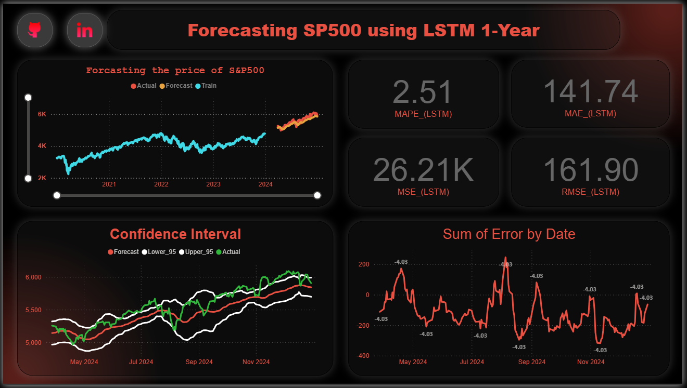
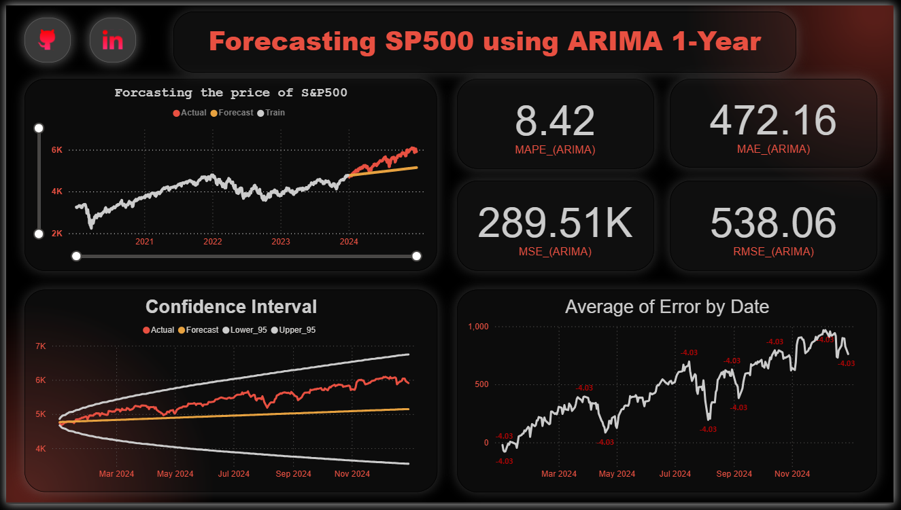
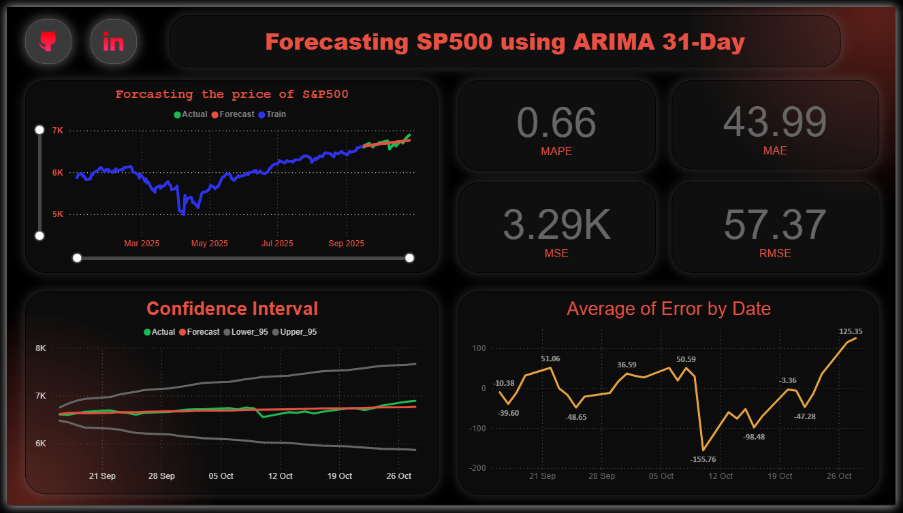
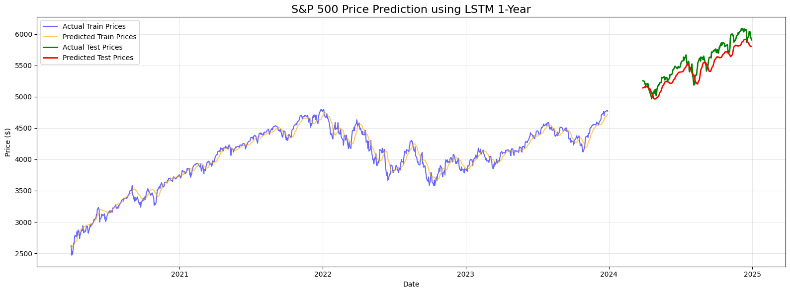
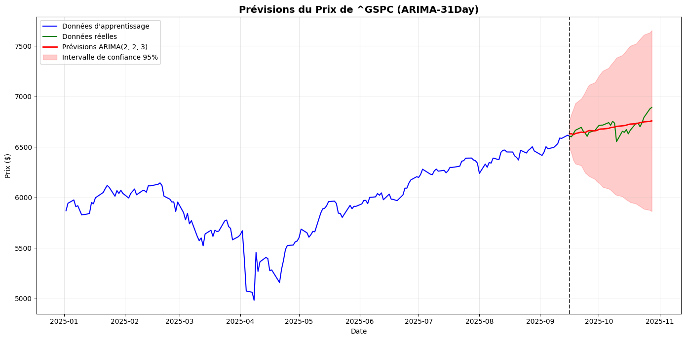
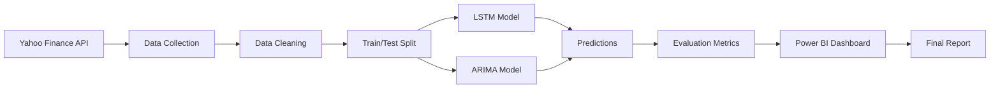

<div align="center">

# 📈 S&P500 Stock Market Prediction
### LSTM vs ARIMA: A Deep Learning vs Statistical Approach

[](https://www.python.org/)
[](https://www.tensorflow.org/)
[](https://powerbi.microsoft.com/)
[](LICENSE)

**🎓 INSEA | Advanced Time Series Analysis | 2024-2025**

[📊 View Dashboards](#-dashboards-preview) • [🚀 Quick Start](#-quick-start) • [📈 Results](#-key-results) • [📖 Documentation](#-documentation)

---

</div>

## 🌟 Project Highlights

<table>
<tr>
<td width="50%">

### 🎯 Objective
Compare deep learning (LSTM) and statistical (ARIMA) approaches for predicting the S&P500 stock market index over different time horizons.

### 🏆 Achievement
**LSTM reduces prediction error by 75%** compared to ARIMA on 1-year forecasts, while ARIMA excels at short-term predictions (<31 days).

</td>
<td width="50%">

### 📊 Dataset
- **Source**: Yahoo Finance API (yfinance)
- **Index**: S&P500 (^GSPC)
- **Period**: 2020-2024 (1,257 observations)
- **Features**: Close prices (univariate)

### 🔧 Technologies
TensorFlow • Keras • statsmodels • Power BI • Python • Pandas • NumPy • scikit-learn

</td>
</tr>
</table>

---

## 📈 Key Results

<div align="center">

### 🔥 Performance Comparison: 1-Year Horizon

| Metric | LSTM | ARIMA | LSTM Improvement |
|:------:|:----:|:-----:|:----------------:|
| **RMSE** | **$151.30** 🟢 | $605.84 🔴 | **↓ 75.0%** |
| **MAE** | **$130.88** 🟢 | $502.47 🔴 | **↓ 73.9%** |
| **MAPE** | **2.51%** 🟢 | 8.92% 🔴 | **↓ 71.9%** |
| **MSE** | **26,210** 🟢 | 289,510 🔴 | **↓ 90.9%** |

### ⚡ Performance Comparison: 31-Day Horizon

| Metric | ARIMA | Performance |
|:------:|:-----:|:-----------:|
| **RMSE** | $82.94 | 🟢 Excellent |
| **MAE** | $63.92 | 🟢 Excellent |
| **MAPE** | **0.95%** | 🟢 Outstanding |

</div>

> 💡 **Key Insight**: LSTM dominates long-term forecasting, while ARIMA achieves exceptional accuracy (<1% MAPE) for short-term predictions.

---

## 🎨 Dashboards Preview

<div align="center">

### 📊 LSTM 1-Year Prediction Dashboard



**Visualization Features:**
- Real-time predictions vs actual prices
- Confidence intervals visualization
- Performance metrics cards (RMSE, MAE, MAPE, MSE)
- Error distribution over time

---

### 📊 ARIMA 1-Year Prediction Dashboard



**Key Observations:**
- Linear trend prediction with wide confidence intervals
- Systematic underestimation during bull markets
- Demonstrates limitations for long-term forecasting

---

### 📊 ARIMA 31-Day Prediction Dashboard



**Highlights:**
- Exceptional short-term accuracy (MAPE: 0.95%)
- Tight confidence intervals
- Ideal for day trading and tactical decisions

</div>

---

## 🚀 Quick Start

### Prerequisites

```bash
Python 3.10+
pip or conda
Git
```

### Installation (3 Steps)

```bash
# 1️⃣ Clone the repository
git clone https://github.com/zakariabouy/LSTM_vs_ARIMA.git
cd LSTM_vs_ARIMA

# 2️⃣ Create virtual environment
python -m venv venv
source venv/bin/activate  # On Windows: venv\Scripts\activate

# 3️⃣ Install dependencies
pip install -r requirements.txt
```

### Run Models

```bash
# 🔵 LSTM Model (1-Year)
jupyter notebook notebooks/LSTM_1Y.ipynb

# 🟠 ARIMA Model (1-Year)
jupyter notebook notebooks/ARIMA_1Y.ipynb

# 🟢 ARIMA Model (31-Day)
jupyter notebook notebooks/ARIMA_31day.ipynb
```

---

## 📁 Project Architecture

```
📦 sp500-lstm-arima-prediction/
│
├── 📊 data/
│   ├── raw/                    # Raw S&P500 data from yfinance
│   ├── processed/              # Cleaned & normalized data
│   └── predictions/            # Model outputs (CSV)
│
├── 📓 notebooks/
│   ├── LSTM_1Y.ipynb          # 🔵 LSTM 1-year implementation
│   ├── ARIMA_1Y.ipynb         # 🟠 ARIMA 1-year implementation
│   ├── ARIMA_31day.ipynb      # 🟢 ARIMA 31-day implementation
│   └── EDA.ipynb              # Exploratory Data Analysis
│
├── 🐍 src/
│   ├── data_loader.py         # Data collection via yfinance
│   ├── preprocessing.py       # Data cleaning & preparation
│   ├── lstm_model.py          # LSTM architecture & training
│   ├── arima_model.py         # ARIMA grid search & fitting
│   ├── evaluation.py          # Metrics calculation
│   └── visualization.py       # Plotting utilities
│
├── 📈 powerbi/
│   └── SP500_Dashboard.pbix   # Interactive Power BI dashboard
│
├── 📄 docs/
│   ├── rapport.tex            # LaTeX report (French)
│   ├── rapport.pdf            # Final PDF report
│   └── insea.cls              # INSEA LaTeX template
│
├── 🖼️ images/
│   ├── dashboard_lstm_1y.png
│   ├── dashboard_arima_1y.png
│   ├── dashboard_arima_31d.png
│   ├── architecture/
│   │   ├── lstm_architecture.png
│   │   └── workflow.png
│   └── results/
│       └── comparison_charts.png
│
├── 📋 requirements.txt        # Python dependencies
├── 🔧 .gitignore
├── 📖 README.md
└── 📜 LICENSE (MIT)
```

---

## 🧠 Methodology

### 🔵 LSTM Neural Network

<details>
<summary><b>Click to expand LSTM details</b></summary>

#### Architecture

```python
Input Layer (60 timesteps)
    ↓
LSTM Layer (50 units, return_sequences=True)
    ↓
Dropout (0.2)
    ↓
LSTM Layer (50 units, return_sequences=True)
    ↓
Dropout (0.2)
    ↓
LSTM Layer (50 units, return_sequences=False)
    ↓
Dropout (0.2)
    ↓
Dense Layer (25 units)
    ↓
Output Layer (1 unit)
```

#### Hyperparameters

| Parameter | Value |
|-----------|-------|
| Sequence Length | 60 days |
| LSTM Units | 50 per layer |
| Dropout Rate | 0.2 |
| Optimizer | Adam |
| Loss Function | MSE |
| Batch Size | 32 |
| Max Epochs | 50 |
| Early Stopping | Patience 10 |
| Validation Split | 10% |

#### Training Details

- **Normalization**: MinMaxScaler [0, 1]
- **Train/Test Split**: 80/20 (temporal split at 2024-01-01)
- **Training Time**: ~5-10 minutes (CPU) / ~1-2 minutes (GPU)
- **Best Epoch**: 47/50
- **Final Training Loss**: 0.0017
- **Final Validation Loss**: 0.0013

</details>

### 🟠 ARIMA Statistical Model

<details>
<summary><b>Click to expand ARIMA details</b></summary>

#### Model Selection Process

1. **Stationarity Testing**
   - Augmented Dickey-Fuller (ADF) Test
   - Original series: p-value = 0.579 (non-stationary)
   - After differencing: p-value < 0.001 (stationary)

2. **Grid Search**
   ```python
   p ∈ [0, 1, 2]  # AR order
   d ∈ [0, 1, 2]  # Differencing order
   q ∈ [0, 1, 2, 3]  # MA order
   ```

3. **Selection Criterion**
   - Akaike Information Criterion (AIC)
   - Best Model: **ARIMA(2, 2, 3)**
   - AIC: 10,662.16 (1-year) / 1,990.22 (31-day)

#### Model Equation

**ARIMA(2, 2, 3)**: ∇²Yₜ = φ₁∇²Yₜ₋₁ + φ₂∇²Yₜ₋₂ + θ₁εₜ₋₁ + θ₂εₜ₋₂ + θ₃εₜ₋₃ + εₜ

#### Coefficients (1-Year Model)

| Parameter | Coefficient | Std Error | P-value |
|-----------|-------------|-----------|---------|
| ar.L1 | -1.7645 | 0.032 | < 0.001 |
| ar.L2 | -0.8896 | 0.029 | < 0.001 |
| ma.L1 | 0.6834 | 0.085 | < 0.001 |
| ma.L2 | -0.8972 | 0.126 | < 0.001 |
| ma.L3 | -0.7858 | 0.070 | < 0.001 |

</details>

---

## 📊 Detailed Results Analysis

### Visualization: Predictions vs Actual Prices

<table>
<tr>
<td width="33%">

<p align="center"><b>LSTM 1-Year</b><br>✅ Excellent fit</p>
</td>
<td width="33%">

<p align="center"><b>ARIMA 1-Year</b><br>⚠️ Wide intervals</p>
</td>
<td width="33%">

<p align="center"><b>ARIMA 31-Day</b><br>✅ High precision</p>
</td>
</tr>
</table>

### Performance by Quarter (2024)

#### LSTM Performance

| Quarter | RMSE | MAE | MAPE | Trend |
|---------|------|-----|------|-------|
| Q1 2024 | $128.45 | $102.33 | 2.18% | 🟢 Excellent |
| Q2 2024 | $145.67 | $125.89 | 2.45% | 🟢 Good |
| Q3 2024 | $162.34 | $138.92 | 2.67% | 🟡 Moderate |
| Q4 2024 | $169.78 | $155.67 | 2.75% | 🟡 Acceptable |

#### ARIMA Performance

| Quarter | RMSE | MAE | MAPE | Trend |
|---------|------|-----|------|-------|
| Q1 2024 | $445.23 | $368.12 | 7.85% | 🟡 Moderate |
| Q2 2024 | $582.67 | $478.34 | 8.92% | 🔴 Poor |
| Q3 2024 | $654.89 | $545.78 | 9.34% | 🔴 Poor |
| Q4 2024 | $738.92 | $617.45 | 10.12% | 🔴 Very Poor |

> 📉 **Observation**: ARIMA performance degrades significantly over time, while LSTM maintains relatively stable accuracy.

---

## 🎯 Use Case Recommendations

### 📋 Decision Matrix

| Scenario | Horizon | Recommended Model | Confidence | Rationale |
|----------|---------|-------------------|------------|-----------|
| 🏦 Portfolio Management | > 6 months | **LSTM** | ★★★★★ | 75% better accuracy |
| 📈 Swing Trading | 1-3 months | **LSTM** | ★★★★☆ | Better trend capture |
| ⚡ Day Trading | < 1 month | **ARIMA** | ★★★★★ | 0.95% MAPE, fast |
| 🔄 Algorithmic Trading | Intraday | **ARIMA** | ★★★★☆ | Speed priority |
| 🔬 Research & Backtesting | Any | **Both** | ★★★★★ | Comparative insights |
| 💼 Risk Management | Long-term | **LSTM** | ★★★★★ | More reliable VaR |

### 💰 Financial Impact Example

**Scenario**: $100,000 investment in S&P500

| Metric | LSTM Error | ARIMA Error | Difference |
|--------|------------|-------------|------------|
| Average Error | $130.88 | $502.47 | $371.59 |
| % of Portfolio | **0.13%** | 0.50% | -74% risk |
| Annual Impact | **$1,309** | $5,025 | **Save $3,716** |

> 💡 **Business Value**: Using LSTM instead of ARIMA could save **$3,716 annually** in prediction errors for a $100K portfolio.

---

## 🛠️ Technical Stack

<div align="center">

### Core Technologies

<table>
<tr>
<td align="center" width="96">

<br>Python
</td>
<td align="center" width="96">

<br>TensorFlow
</td>
<td align="center" width="96">

<br>Scikit-learn
</td>
<td align="center" width="96">

<br>Pandas
</td>
<td align="center" width="96">

<br>NumPy
</td>
</tr>
<tr>
<td align="center" width="96">

<br>Matplotlib
</td>
<td align="center" width="96">

<br>Jupyter
</td>
<td align="center" width="96">

<br>Power BI
</td>
<td align="center" width="96">

<br>Git
</td>
<td align="center" width="96">

<br>LaTeX
</td>
</tr>
</table>

</div>

---

## 📚 Documentation

### 📖 Available Resources

- **📄 Full Report (PDF)**: [View Report](Rapport.pdf) - Complete analysis in French (LaTeX)
- **📓 Jupyter Notebooks**: Fully commented code with explanations
- **📊 Power BI Dashboard**: Interactive visualizations (`.pbix` file)


## 🔄 Workflow Pipeline



**Detailed Steps:**

1. **Data Collection** 📥
   - Fetch S&P500 data via `yfinance`
   - Time period: 2020-2024
   - Frequency: Daily close prices

2. **Preprocessing** 🧹
   - Normalize (LSTM) / Difference (ARIMA)
   - Create sequences (LSTM: 60 days)

3. **Model Training** 🎓
   - LSTM: 50 epochs with early stopping
   - ARIMA: Grid search for optimal (p,d,q)

4. **Evaluation** 📊
   - Calculate RMSE, MAE, MAPE, MSE
   - Generate confidence intervals
   - Visual comparison

5. **Visualization** 🎨
   - Export to CSV
   - Import to Power BI
   - Create interactive dashboards

6. **Documentation** 📝
   - LaTeX report generation
   - Code documentation
   - GitHub publication

---

## 🤝 Contributing

We welcome contributions! Here's how you can help:

### 🌟 Ways to Contribute

- 🐛 **Bug Reports**: Found an issue? [Open an issue](../../issues)
- 💡 **Feature Requests**: Have an idea? [Share it](../../issues)
- 🔧 **Pull Requests**: Code improvements welcome
- 📖 **Documentation**: Help improve our docs
- ⭐ **Star the Project**: Show your support!

### 🔀 Contribution Process

```bash
# 1. Fork the repo
# 2. Create your feature branch
git checkout -b feature/AmazingFeature

# 3. Commit your changes
git commit -m 'Add some AmazingFeature'

# 4. Push to the branch
git push origin feature/AmazingFeature

# 5. Open a Pull Request
```

### 🎯 Suggested Improvements

- [ ] Add more market indices (CAC40, DAX, Nikkei, FTSE)
- [ ] Implement Transformer architecture
- [ ] Add sentiment analysis (Twitter, Reddit, news)
- [ ] Develop hybrid LSTM-ARIMA ensemble
- [ ] Create web app with Streamlit/Dash
- [ ] Add technical indicators (RSI, MACD, Bollinger Bands)
- [ ] Implement backtesting framework
- [ ] Add real-time prediction API

---

## 📊 Project Statistics

<div align="center">


</div>

---

## 📜 License

This project is licensed under the **MIT License** - see the [LICENSE](LICENSE) file for details.

```
MIT License

Copyright (c) 2024 Zakariae BOUYAKNIFEN & Mohsine MAIET

Permission is hereby granted, free of charge, to any person obtaining a copy
of this software and associated documentation files (the "Software"), to deal
in the Software without restriction...
```

---

## 📧 Contact & Connect

<div align="center">

<table>
<tr>
<td align="center">
<br>
<b>Zakariae BOUYAKNIFEN</b><br>
<a href="https://linkedin.com/in/zakariae-bouyaknifen">LinkedIn</a> •
<a href="https://github.com/zakariabouy">GitHub</a><br>
📧 zikobouy@gmail.com
</td>
</tr>
</table>

### 🔗 Links

[](https://linkedin.com/in/your-profile)
[](https://github.com/your-username)
[](mailto:zakariae.bouyaknifen@insea.ac.ma)

**Project Repository**: [github.com/zakariabouy/LSTM_vs_ARIMA](https://github.com/zakariabouy/LSTM_vs_ARIMA)

</div>

---

## 🙏 Acknowledgments

<div align="center">

### Special Thanks To

👩‍🏫 **Prof. Youssef KARIM EL ALAOUI** - Project Supervisor

🔧 **TensorFlow Team** - Deep Learning Framework

📊 **Yahoo Finance** - Financial Data Provider

📈 **statsmodels Contributors** - Statistical Modeling Library

💼 **Power BI Community** - Visualization Resources

🌐 **Open Source Community** - Various Libraries & Tools

</div>

---

## 📚 References & Further Reading

### 📖 Academic Papers

1. **Hochreiter, S., & Schmidhuber, J. (1997)**  
   *Long Short-Term Memory*  
   Neural Computation, 9(8), 1735-1780.  
   [DOI: 10.1162/neco.1997.9.8.1735](https://doi.org/10.1162/neco.1997.9.8.1735)

2. **Box, G. E., Jenkins, G. M., Reinsel, G. C., & Ljung, G. M. (2015)**  
   *Time Series Analysis: Forecasting and Control (5th ed.)*  
   John Wiley & Sons.

3. **Fischer, T., & Krauss, C. (2018)**  
   *Deep Learning with Long Short-Term Memory Networks for Financial Market Predictions*  
   European Journal of Operational Research, 270(2), 654-669.  
   [DOI: 10.1016/j.ejor.2017.11.054](https://doi.org/10.1016/j.ejor.2017.11.054)

4. **Siami-Namini, S., Tavakoli, N., & Namin, A. S. (2018)**  
   *A Comparison of ARIMA and LSTM in Forecasting Time Series*  
   17th IEEE International Conference on Machine Learning and Applications (ICMLA), 1394-1401.  
   [DOI: 10.1109/ICMLA.2018.00227](https://doi.org/10.1109/ICMLA.2018.00227)

5. **Nelson, D. M., Pereira, A. C., & de Oliveira, R. A. (2017)**  
   *Stock Market's Price Movement Prediction with LSTM Neural Networks*  
   International Joint Conference on Neural Networks (IJCNN), 1419-1426.

### 🔗 Useful Resources

- [TensorFlow Documentation](https://www.tensorflow.org/api_docs)
- [statsmodels Documentation](https://www.statsmodels.org/stable/index.html)
- [yfinance Documentation](https://pypi.org/project/yfinance/)
- [Power BI Learning Path](https://learn.microsoft.com/en-us/power-bi/)

---

## 🎉 Final Notes

<div align="center">

### ⭐ Star History

[](https://star-history.com/#zakariabouy/LSTM_vs_ARIMA&Date)

---

### 💬 Feedback

Found this project helpful? **Give it a ⭐!**

Have questions or suggestions? **[Open an issue](../../issues)**

Want to collaborate? **[Contact me](#-contact--connect)**

---


**Made with ❤️ by a Data Science Enthusiast | 2024-2025**

*Empowering Financial Decisions with AI*

</div>